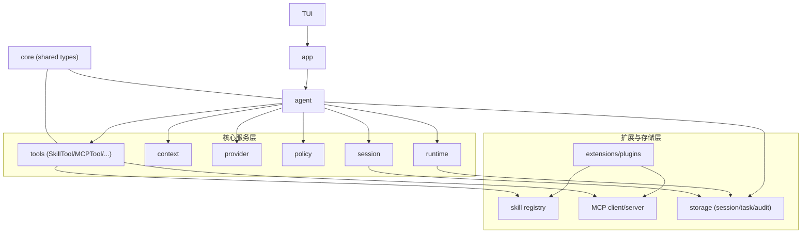

# bytemind 总体架构设计文档（Go 生态）

## 1. 文档目标
本文档定义 bytemind 的总体架构基线。

## 2. 既定约束
- 单入口 TUI。
- 会话与任务写入文件。

## 3. 架构目标
- 支持 coding agent 主闭环：理解任务、调用工具、修改代码、执行验证、返回结果。
- 支持长任务与并发：任务系统、后台执行、子代理协作。
- 支持扩展：MCP、Skills。
- 支持安全可控：权限分层、沙箱执行、风险拦截。
- 支持工程治理：可恢复、可追踪、可测试。
- 支持最小审计闭环：关键决策与关键执行可追溯、可回放

## 4. 架构原则
- Secure by Default：默认最小权限，高风险操作显式确认。
- 单一职责：原子能力优先，复杂行为通过编排组合。
- 显式状态：关键状态可持久化、可回放、可恢复。
- 流式优先：事件级输出，避免黑盒执行。
- 低耦合扩展：核心稳定，扩展通过标准契约接入。
- 可验证性：核心机制均有可执行测试与验收指标。

## 5. 总体架构图

## 6. 目录结构（Go）
```text
bytemind/
  cmd/
    bytemind/
  internal/
    core/
    app/
    agent/
    session/
    context/
    provider/
    tools/
    runtime/
    policy/
    storage/
    extensions/
```

## 7. 模块职责（做什么 / 不做什么）

### core
- 做：跨模块共享基础类型（SessionID/TaskID/Role/Decision/RiskLevel/TaskStatus）与通用错误契约。
- 不做：业务流程、模块专属请求结构、具体实现。

### app
- 做：配置加载、依赖注入、生命周期管理。
- 不做：业务编排与策略判断。

### agent
- 做：用户消息处理、模型交互编排、工具调用协调、结果归并。
- 不做：工具实现细节、权限规则实现、持久化细节。

### session
- 做：会话创建/关闭、模式切换、会话快照与事件回放。
- 不做：模型调用、任务调度、长期记忆。

### context
- 做：上下文拼装、预算计算、压缩裁剪与不变量校验。
- 不做：模型请求发送、权限判定、工具执行。

### provider
- 做：供应商抽象、模型路由、流式事件统一、错误语义化。
- 不做：会话持久化、业务调度、权限判定。

### tools
- 做：工具 schema 校验、执行调度、事件标准化输出。
- 不做：会话级策略决策。

### runtime
- 做：任务状态机、超时/取消/重试、多代理调度与归并。
- 不做：权限规则定义。

### policy
- 做：allow/deny/ask 决策、风险分级、路径/命令/敏感文件防护。
- 不做：业务动作执行。

### storage
- 做：会话/任务日志写入、回放恢复、幂等去重。
- 不做：业务决策与调度。

### extensions
- 做：MCP/Skills 通过统一契约接入 tools。
- 不做：主循环控制。

## 8. 强制依赖约束
- 禁止循环依赖。
- `app` 只做装配，不承载业务逻辑。
- `agent` 仅通过接口访问 `session/context/provider/tools/runtime/policy/storage`。
- `extensions` 不可直接读写 `agent` 内部状态。
- `policy` 必须可独立测试，不依赖 `agent` 具体实现。
- 公共类型只允许放在 `core`，模块接口只放本模块特有结构。

## 9. 统一接口约束
- 接口按调用方视角定义，避免泄漏实现细节。
- 所有阻塞操作必须接收 `context.Context`。
- 错误优先语义化（可判断、可测试）。
- 事件流统一使用 channel/迭代器风格。
- 接口层禁止引入具体 provider/tool 实现类型。

## 10. 核心执行流程

### 10.1 单代理主闭环
1. 用户提交消息到 `agent`。
2. `agent` 读取 `session` 快照。
3. `context` 构建上下文并计算预算。
4. `provider` 执行流式推理。
5. 工具调用前经 `policy` 决策。
6. `tools/runtime` 执行并返回结果事件。
7. `storage` 写入会话/任务日志，`session` 更新状态。
8. `agent` 返回最终响应。

### 10.2 自动压缩（无 Memory）
- `warning >= 85%`，`critical >= 95%`。
- `tool_use` 与 `tool_result` 成对保留。
- `prompt_too_long` 触发一次 reactive compact + 重试。

### 10.3 任务系统
- 状态机：`pending -> running -> completed|failed|killed`。
- 机制：超时、取消传播、最大重试次数、终态回收。
- 输出：任务日志按 offset 增量读取。

### 10.4 子代理
- 同步子代理：父代理等待返回。
- 异步后台代理：父代理继续执行，后续归并。
- worktree 隔离代理：独立工作区执行，避免污染主工作区。

## 11. Tools 体系

### 11.1 三层结构
- 原子工具层：`ReadFile/EditFile/WriteFile/Glob/Grep/Bash`
- 组合工具层：`TestRunner/GitWorkflow/TaskOutputReader`
- 协作工具层：`AgentTool/MCPTool/SkillTool/TeamTool`

### 11.2 统一契约
```go
type Tool interface {
    Name() string
    Description() string
    Schema() json.RawMessage
    Execute(ctx context.Context, args json.RawMessage, tctx ToolUseContext) (<-chan ToolEvent, error)
}
```

### 11.3 强制规范
- 参数 schema 强校验。
- 显式声明副作用级别与幂等级别。
- 支持超时、取消、重试语义。
- 统一事件流：`start/chunk/result/error`。
- 每个工具必须有 mock/contract 单测。

## 12. 权限与安全架构

### 12.1 五层权限模型
- 会话模式层：`default/acceptEdits/bypassPermissions(受控)/plan`
- 工具白黑名单层：`allowedTools/deniedTools`
- 工具级策略层：读默认放行，写与命令默认询问
- 风险层：`low/medium/high`
- 路径命令层：`allowedWritePaths/deniedWritePaths/allowedCommands/deniedCommands`

### 12.2 决策优先级（固定）
`hard_deny > explicit_deny > risk_rule > explicit_allow(仅低中风险可生效) > mode_default > fallback_ask`

### 12.3 安全基线
- Prompt Injection：系统指令优先，工具输出隔离。
- 路径安全：`resolve + realpath + allowlist`。
- 命令安全：白名单 + 高危规则。
- 敏感文件保护：密钥/凭证默认拒绝读取。
- 沙箱策略：网络开关、路径白名单、资源限额。

## 13. 文件存储与恢复（不落库）

### 13.1 文件布局
- `~/.bytemind/sessions/<session-id>.jsonl`
- `~/.bytemind/tasks/<task-id>.log`
- `~/.bytemind/audit/<date>.jsonl`

### 13.2 一致性策略
- append-only 写入。
- 单记录原子落盘（`tmp+rename` 或 `fsync`）。
- 会话级文件锁，避免并发乱序。
- 事件携带 `event_id`，恢复时幂等去重。
- 审计记录采用 append-only，与会话/任务日志一致的原子写策略。
- 每条审计事件包含 `event_id/session_id/task_id/trace_id/timestamp`，启动恢复时按 `event_id` 幂等去重。

### 13.3 最小审计范围
- 必记事件：`permission_decision`、`permission_ask_resolved`、`tool_execute_start`、`tool_execute_result`、`task_state_changed`。
- 必记字段：`event_id`、`session_id`、`task_id`、`trace_id`、`actor`、`action`、`decision`、`reason_code`、`risk_level`、`result`、`latency_ms`。
- 脱敏要求：命令参数和文件内容中的密钥/凭证必须脱敏后写入。

## 14. 可观测性

### 14.1 指标
- 请求成功率、工具成功率、任务成功率。
- 首字节时延（模型/工具/存储分层）。
- token 消耗与单位任务成本。
- 权限拒绝率与高危拦截率。
- 压缩触发率与恢复成功率。

### 14.2 Trace
链路贯穿：`agent -> session -> context -> provider -> policy -> tools -> runtime -> storage`

## 15. 测试与治理要求（强制）
- Contract Test：工具 schema、事件流一致性。
- Replay Test：session/task 回放一致性。
- Policy Test：规则冲突、优先级、边界样例。
- Failure Test：超时、取消、崩溃恢复、重试风暴。
- Sub-Agent Test：并发配额、资源争用、冲突归并。
- 安全回归：高危命令、敏感文件、路径逃逸。
- Audit Replay Test：基于 `audit + session/task` 可还原关键执行链路，且重复回放结果一致。

## 16. 主要风险与应对
- 工具误操作风险。应对：多层权限 + 高危确认 + 沙箱。
- 上下文膨胀风险。应对：预算器 + 自动压缩。
- 子代理复杂度风险。应对：依赖图调度 + 配额控制 + 终态约束。
- 文件一致性风险。应对：原子写 + 锁 + 幂等回放。
